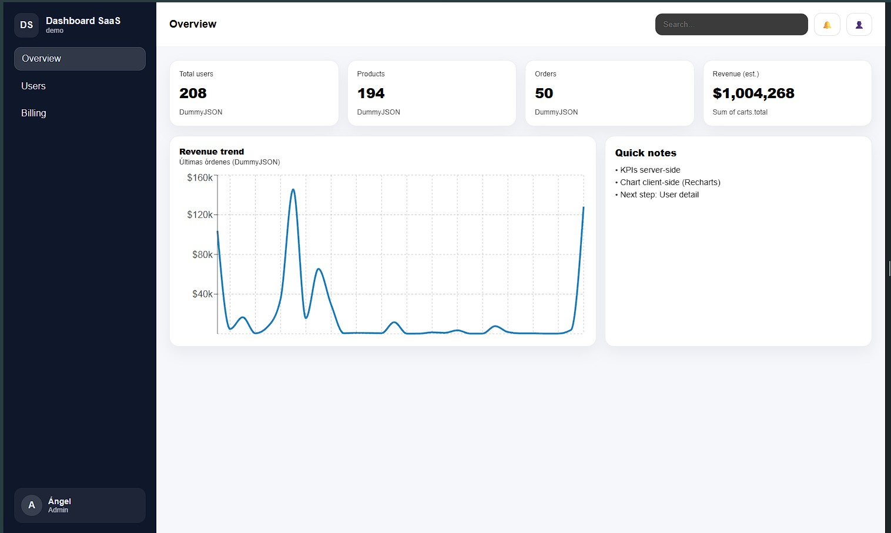
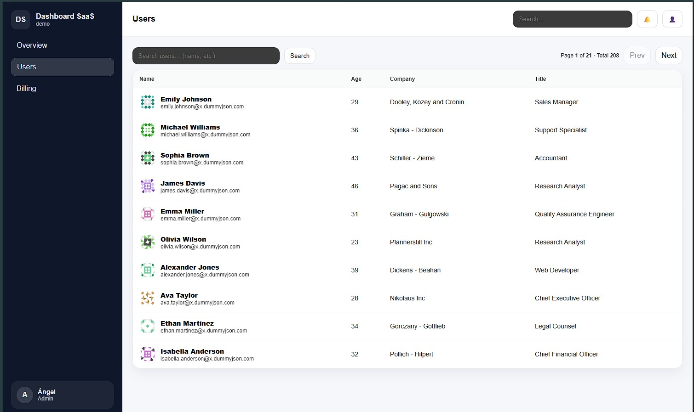
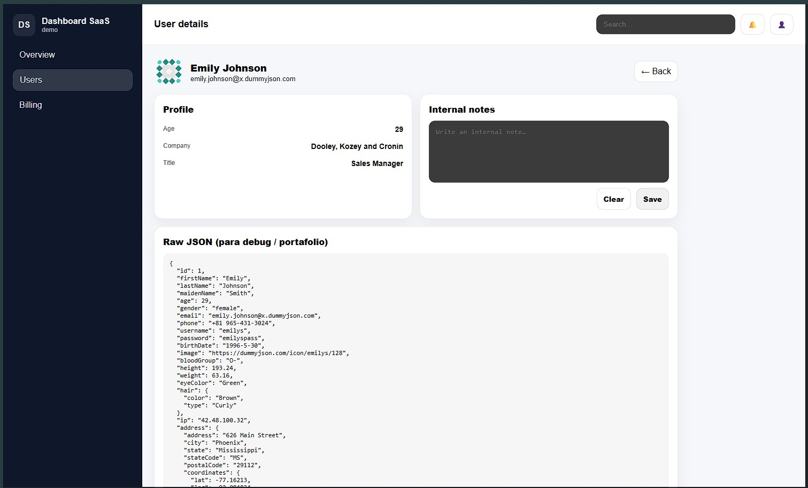

# Dashboard SaaS (Next.js + TypeScript + SCSS Modules)

Mini dashboard estilo SaaS (portafolio) con:
- Overview (KPIs + chart)
- Users (tabla con paginación + búsqueda + detalle)
- Billing (planes + invoices mock)
- UI responsive (sidebar móvil)
- 404 SaaS para rutas inválidas
- Skeleton loaders (loading states)

## Stack
- Next.js (App Router)
- TypeScript
- SCSS Modules
- Recharts (charts)
- DummyJSON (API pública para datos mock)

## Features
### Overview
- KPIs: Total users, products, orders, revenue estimado (suma de carts.total)
- Chart: tendencia de revenue por orden (DummyJSON carts)

### Users
- Tabla de usuarios con:
  - paginación real (limit/skip)
  - búsqueda (q)
  - detalle por usuario (/dashboard/users/[id])
- Loading states con `loading.tsx`

### Billing
- Plan cards con toggle mensual/anual
- Invoices table (mock)

### UX / UI
- Sidebar con link activo
- Responsive: sidebar colapsable en móvil con overlay
- 404 custom en user detail route

## API endpoints (DummyJSON)
- Users: https://dummyjson.com/users?limit=10&skip=0
- Users search: https://dummyjson.com/users/search?q=john&limit=10&skip=0
- User detail: https://dummyjson.com/users/1
- Products total: https://dummyjson.com/products?limit=1
- Carts: https://dummyjson.com/carts?limit=100

## Screenshots

### Overview


### Users


### User detail


### Billing


## Getting started
```bash
npm install
npm run dev
